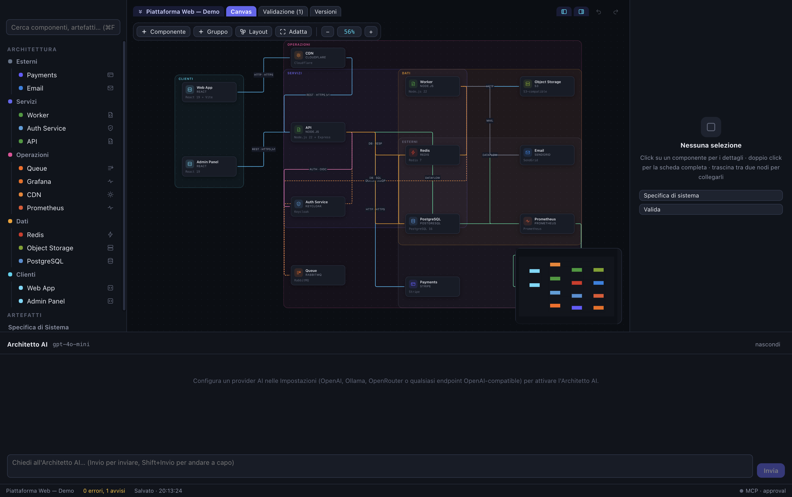
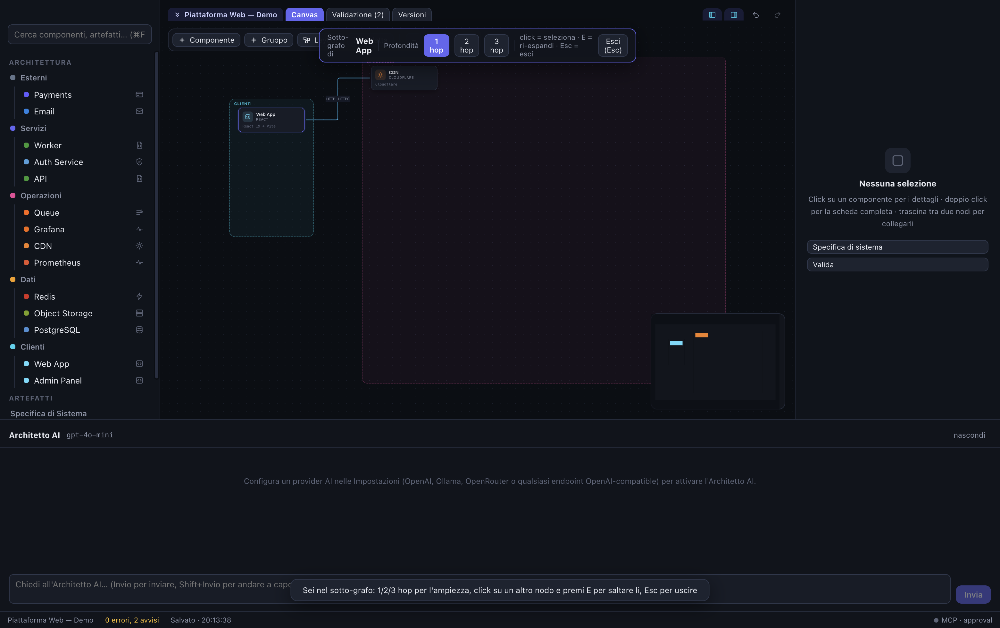
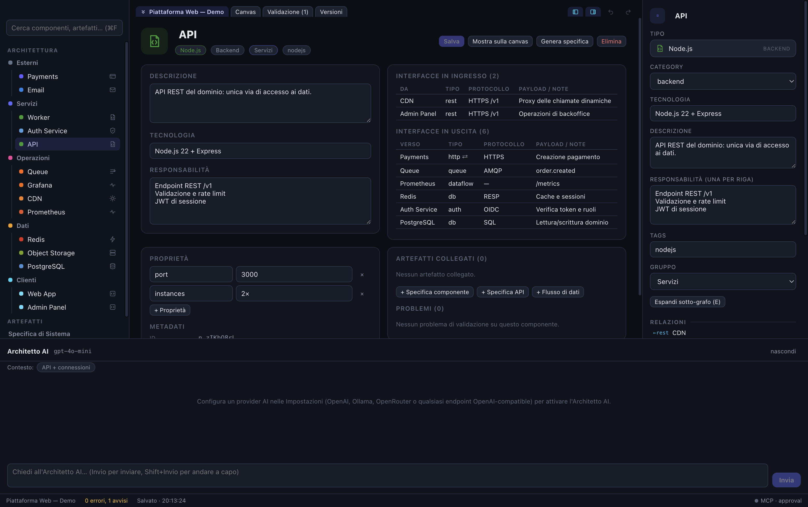
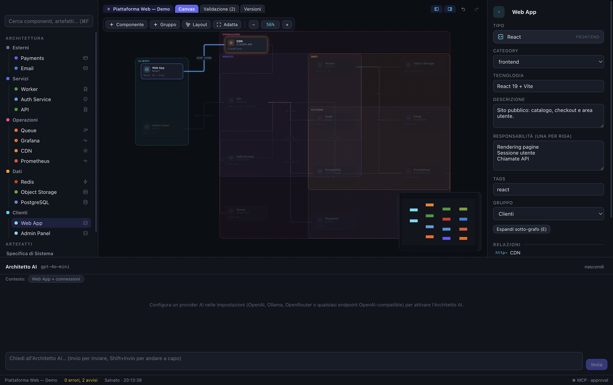

# ArchiStudio

**Design software architecture before code.** A desktop tool where the architecture itself is the source of truth: a visual graph you build, an AI architect that proposes changes you approve, derived specification documents — and a built-in **MCP server** that makes the whole model readable and editable by external AI agents (Cursor, Claude Desktop, Zcode and any MCP-compatible client).

> The architecture is the source of truth. Artifacts are derived from it, never the other way around.



## Why

Between "idea" and "code" there is usually a gap filled with static diagrams that nobody updates and no agent can read. ArchiStudio fills that gap with a **living, structured model**: navigable by humans, queryable by AI, versionable with git.

## Features

- **Visual canvas** — components, typed relations (REST, DB, queue, event, auth...), groups, minimap, semantic zoom, snap-to-grid, auto-layout
- **169-technology catalog** — PostgreSQL, Kafka, Kubernetes, React, Stripe, OpenAI... each with its own icon, color and category; custom types supported
- **Component detail view** — double-click any node: interfaces, responsibilities, custom properties, linked artifacts, validation issues
- **Hierarchy without clutter** — decompose services into sub-components, collapse them back with one click ("System view <-> Full view"), expand any node's subgraph (1/2/3 hops)
- **AI Architect** — chat that knows your selection context; changes arrive as reviewable proposals (approve/reject); provider-agnostic (OpenAI, Ollama, LM Studio, OpenRouter — any OpenAI-compatible endpoint); **streaming** replies; API key encrypted in the macOS Keychain
- **Derived artifacts** — 8 specification types (requirements, system, component, API, database, data-flow, ADR, deployment) generated from the model, editable in Markdown with live split preview
- **Validation engine** — dangling references, circular dependencies, orphan components, missing responsibilities, unlinked artifacts
- **Versioning** — manual versions become git commits; automatic snapshots before every AI/MCP change; full undo/redo
- **MCP server** — 18 tools + 5 resources over stdio and stateless HTTP; three security modes (read-only / approval / write); audit log
- **Open project format** — plain JSON per entity + Markdown artifacts on disk, readable and diffable without the app





## Getting started

```bash
npm install
npm run dev        # development with HMR
npm test           # unit tests (vitest)
npm run test:mcp   # MCP server end-to-end test
npm run build      # production build (app + MCP bundle)
npm run dist       # macOS .app + .zip (electron-builder)
```

Node.js >= 22 required. On first launch a guided tour walks you through the app, and a **"Piattaforma Web — Demo"** project (a complete web architecture: CDN, API, auth, cache, queue, worker, PostgreSQL, payments, observability) is one click away from the welcome screen.

## The MCP server

Any MCP client can read — and, under your control, modify — the architecture of the open project. The Settings dialog generates the exact configuration with real paths, ready to copy:

```json
{
  "mcpServers": {
    "archistudio": {
      "command": "node",
      "args": [
        "/path/to/archistudio/out/mcp/index.js",
        "--project", "/path/to/your/project",
        "--mode", "approval"
      ]
    }
  }
}
```

**Security modes:** `read-only` (external clients can only read), `approval` (default — external writes become proposals you approve in the app), `write` (direct application with automatic safety snapshot). Every call is recorded in the project audit log. An optional HTTP endpoint (127.0.0.1, bearer token) is available for remote transports.



## Project format

```
my-project/
  project.json
  architecture/
    nodes/<id>.json
    relations/<id>.json
    groups/<id>.json
  artifacts/<slug>--<id>.md   # Markdown with YAML frontmatter
  versions/                    # snapshots
  .archi/                      # pending MCP proposals + audit log
```

No proprietary blob: every entity is a file, git-friendly out of the box.

## Keyboard shortcuts (essentials)

| Keys | Action |
|---|---|
| Cmd+K | Command palette |
| Cmd+Z / Cmd+Shift+Z | Undo / redo (covers AI and MCP changes too) |
| Enter | Rename selected node inline on the canvas |
| E / Esc | Expand subgraph / exit |
| Shift+1 / Shift+2 | Fit all / zoom to selection |
| Cmd+1 Cmd+2 Cmd+J | Toggle panels / chat |
| Space + drag | Pan |

The full list lives in the in-app Help Center (Cmd+/).

## Tech stack

Electron 44 - React 19 - React Flow (@xyflow/react) - Zustand - TypeScript - official MCP TypeScript SDK - dagre - electron-vite. UI language: Italian.

## Status & limitations

Personal-tool maturity: packaging, encrypted key storage, crash logging, e2e-tested MCP. Not yet: code signing/notarization, auto-update.

## License

[MIT](LICENSE) - (c) Vincenzo Di Mauro
